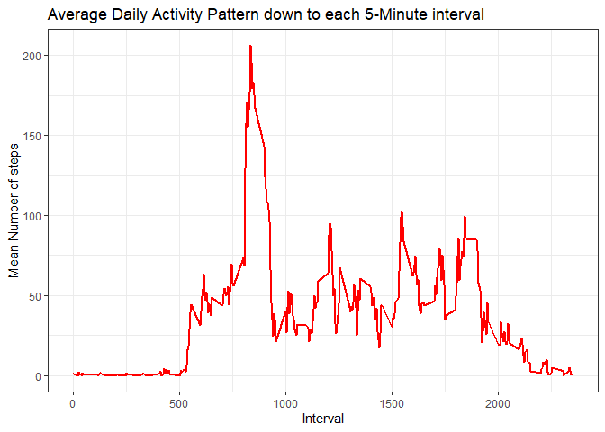

### Daniel Piper's Peer Review Week1 Assgnment

##### This assignment makes use of data from a personal activity monitoring device. This device collects data at 5 minute intervals through out the day. The data consists of two months of data from an anonymous individual collected during the months of October and November, 2012 and include the number of steps taken in 5 minute intervals each day.

##### Variables included in this dataset are 1. steps, 2. date (YYYY-MM-DD), and 3. Interval (5 minute interval i.d. of measurement)

##### Knitr and set global options, no printing of code and load ggplot

```r
library(knitr)
opts_chunk$set(echo = TRUE, results = 'hold')
library(ggplot2)
```


##### read data from .csv, ensure your working directory is accurate

```r
personal_data <- read.csv('activity.csv', header = TRUE, sep = ",",
                  colClasses=c("numeric", "character", "numeric"))
```

##### For plotting and calculations, ensure the data is formatted properly
##### Date is formatted to date

```r
personal_data$date <- as.Date(personal_data$date, format = "%Y-%m-%d")
```
##### The 5- minute intervals are formatted to factors

```r
personal_data$interval <- as.factor(personal_data$interval)
```

##### Data format verification

```r
str(personal_data)
```

```
## 'data.frame':	17568 obs. of  3 variables:
##  $ steps   : num  NA NA NA NA NA NA NA NA NA NA ...
##  $ date    : Date, format: "2012-10-01" "2012-10-01" ...
##  $ interval: Factor w/ 288 levels "0","5","10","15",..: 1 2 3 4 5 6 7 8 9 10 ...
```

## Question 1: What is the mean total number of steps taken per day?

#### Calculate total number of steps taken per day
#### Preview the data with str

```r
steps_per_day <- aggregate(steps ~ date, personal_data, sum)
colnames(steps_per_day) <- c("date","steps")
head(steps_per_day)
```

```
##         date steps
## 1 2012-10-02   126
## 2 2012-10-03 11352
## 3 2012-10-04 12116
## 4 2012-10-05 13294
## 5 2012-10-06 15420
## 6 2012-10-07 11015
```
#### Plot Histrogram of total number of steps taken per day

```r
ggplot(steps_per_day, aes(x = steps)) + 
  geom_histogram(fill = "black", binwidth = 1000) + 
  labs(title="Histogram of Mean Total Steps Taken per Day", 
       x = "Mean Total Number of Steps per Day", y = "Cout of Total Mean Number") + theme_bw() 
```

<!-- -->
#### Calculate and report the mean and median of the total number of steps taken per day
#### Ensure you remove Nulls or missing data

```r
steps_mean   <- mean(steps_per_day$steps, na.rm=TRUE)
steps_median <- median(steps_per_day$steps, na.rm=TRUE)
steps_mean
steps_median
```

```
## [1] 10766.19
## [1] 10765
```

## Question 2: What is the average daily activity pattern?

#### Let's plot a Time series plot of the 5-minute interval (x-Axis) and the average number of steps taken, averaged across all days (y-axis)
#### We will use the aggregrate function, ensure to remove Nulls or missing data

```r
mean_steps_per_interval <- aggregate(personal_data$steps, 
                                by = list(interval = personal_data$interval),
                                FUN=mean, na.rm=TRUE)
```
                                
#### Let's use "as.integer"" function to ensure intervals are converted to integers
### Plot a geom line graph to show results of average number of steps taken per 5 minute interval across entire dataset(all days)

```r
mean_steps_per_interval$interval <- 
  as.integer(levels(mean_steps_per_interval$interval)[mean_steps_per_interval$interval])
colnames(mean_steps_per_interval) <- c("interval", "steps")


ggplot(mean_steps_per_interval, aes(x=interval, y=steps)) +   
  geom_line(color="red", size=1) +  
  labs(title="Average Daily Activity Pattern down to each 5-Minute interval", x="Interval", y="Mean Number of steps") +  
  theme_bw()
```

<!-- -->
#### Which 5 minute interval, on average across all the days, contains the maximum number of steps

```r
max_steps_interval <- mean_steps_per_interval[which.max(  
  mean_steps_per_interval$steps),]
max_steps_interval
```

```
##     interval    steps
## 104      835 206.1698
```
## Imputing missing values

#### Calculate and report the total number of mising values in the dataset

```r
missing_values <- sum(is.na(personal_data$steps))
missing_values
```

```
## [1] 2304
```
#### Devise a strategy for filling in all the missing values in the dataset. 
#### Let's create a function that indexes the missing data for steps in intervals, use unlist and lapply fuctions to replace those blank or null steps (indexed intervals) with value of users choice.
#### Inputs to function are dataset and aggregate value like mean steps of interval

```r
data_fill <- function(data, replacevalue) {
  na_index <- which(is.na(data$steps))
  na_replace <- unlist(lapply(na_index, FUN=function(idx){
    interval = data[idx,]$interval
    replacevalue[replacevalue$interval == interval,]$steps
  }))
  fill_steps <- data$steps
  fill_steps[na_index] <- na_replace
  fill_steps
}
```
#### Create a new dataset that is equal to the original dataset but with the missing values filled in
#### we use the function creted above to fill in the missing data
#### Dataset = personal_data and pervalue = mean_steps_per_interval (Mean Total Steps of Intervals)

```r
personal_data_replace <- data.frame(  
  steps = data_fill(personal_data, mean_steps_per_interval),  
  date = personal_data$date,  
  interval = personal_data$interval)
str(personal_data_replace)
```

```
## 'data.frame':	17568 obs. of  3 variables:
##  $ steps   : num  1.717 0.3396 0.1321 0.1509 0.0755 ...
##  $ date    : Date, format: "2012-10-01" "2012-10-01" ...
##  $ interval: Factor w/ 288 levels "0","5","10","15",..: 1 2 3 4 5 6 7 8 9 10 ...
```
#### check to ensure we filled all missing values


```r
sum(is.na(personal_data_replace$steps))
```

```
## [1] 0
```


#### Make a histogram of the total number of steps taken each day and calculate and report the mean and median total number of steps taken per day

```r
clean_data_steps_per_day <- aggregate(steps ~ date, personal_data_replace, sum)
colnames(clean_data_steps_per_day) <- c("date","steps")

ggplot(clean_data_steps_per_day, aes(x = steps)) + 
  geom_histogram(fill = "black", binwidth = 1000) + 
  labs(title="Histogram of Steps Taken per Day", 
       x = "Number of Steps per Day", y = "Number of times in a day(Count)") + theme_bw() 
```

<!-- -->

```r
clean_data_mean_steps   <- mean(clean_data_steps_per_day$steps, na.rm=TRUE)
clean_data_median_steps <- median(clean_data_steps_per_day$steps, na.rm=TRUE)
clean_data_mean_steps
clean_data_median_steps
```

```
## [1] 10766.19
## [1] 10766.19
```
## Are there differences in activity patterns between weekdays and weekends?
#### Create a new factor variable in the dataset with two levels -"weekday" and "weekend"
#### Let's create a function to take dataset and first aggregate to the mean number of steps per interval
#### Second, convert intervals to integers

```r
weekdays_steps <- function(data) {
  weekdays_steps <- aggregate(data$steps, by=list(interval = data$interval),
                              FUN=mean, na.rm=T)
  weekdays_steps$interval <- 
    as.integer(levels(weekdays_steps$interval)[weekdays_steps$interval])
  colnames(weekdays_steps) <- c("interval", "steps")
  weekdays_steps
}
```
#### Make a panel plot containing a time series plot of the 5-minute interval and the average number of steps taken, averaged across all the weekdays or weekend days. 
#### Let's create a function to create a new factor in the dataset based on date, the factor will determine if date is a weekday or weekend
#### the function does this by using the "weekdays" function in R
#### Then will subset the data into two subsets (weekdays and Weekends)
#### Then will run the two subsets through the above function to determine the mean total steps for each subset
#### Then will create a column "days of week" in each subset to annotate whether dataset is weekdays or weekends

```r
data_by_weekdays <- function(data) {
  data$weekday <- 
    as.factor(weekdays(data$date)) # weekdays
  weekend_data <- subset(data, weekday %in% c("Saturday","Sunday"))
  weekday_data <- subset(data, !weekday %in% c("Saturday","Sunday"))
  
  weekend_steps <- weekdays_steps(weekend_data)
  weekday_steps <- weekdays_steps(weekday_data)
  
  weekend_steps$dayofweek <- rep("weekend", nrow(weekend_steps))
  weekday_steps$dayofweek <- rep("weekday", nrow(weekday_steps))
  
  data_by_weekdays <- rbind(weekend_steps, weekday_steps)
  data_by_weekdays$dayofweek <- as.factor(data_by_weekdays$dayofweek)
  data_by_weekdays
}

data_weekdays <- data_by_weekdays(personal_data_replace)
```

#### Now we plot the Mean total steps results between the weekdays and weekends subsets

```r
ggplot(data_weekdays, aes(x=interval, y=steps)) + 
  geom_line(color="red") + 
  facet_wrap(~ dayofweek, nrow=2, ncol=1) +
  labs(x="Interval", y="Mean Total Steps per Interval") +
  theme_bw()
```

<!-- -->
